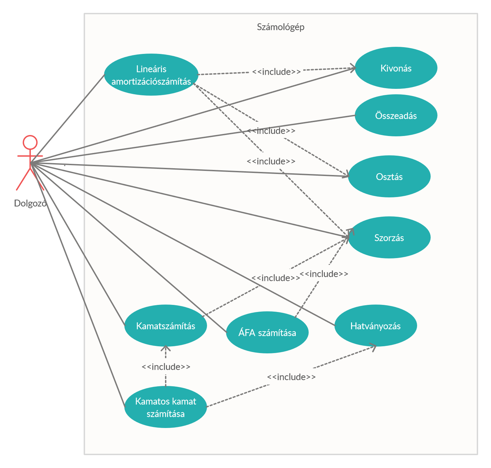

Funkcionális specifikáció
=========================

Rendszer céljai, nem céljai
---------------------------
### A rendszer célja, hogy:
* szükségtelenné tegye külsős fejlesztők alkalmazásának használatát.
* egységes megoldást biztosítson a cég számára a számítások elvégzéséhez.
* támogatást nyújtson látás problémákkal küzdő alkalmazottak munkájához.
* intuitív felhasználói felületet biztosítson.
* a felhasználói felületet személyre szabható legyen, ezzel hatékonyabbá téve az egyes részlegeken dolgozók munkáját.
* teljesen platformfüggetlen legyen.

### A rendszernek nem célja, hogy:
* teljesen helyettesítse a tudományos számológépeket.
* az alkalmazottak munkájához szükséges műveleteken felül egyéb műveleteket biztosítson.

Jelenlegi helyzet leírása
-------------------------
A megrendelő cég könyveléssel foglalkozik, különböző hazai cégek és egyéni vállalkozók számára könyvelnek. Ez a szakma sok számolást igényel, jelenleg ehhez leginkább a Windows alapvető számológépét használják. Ennek az "Általános" felülete túl kevés funkcióval rendelkezik a munka elvégzéséhez, míg a "Tudományos" felület túl bonyolultnak bizonyul sok kolléga számára. Ez, hogy sokan eltérő felületet használnak, feleslegesen bonyolítja a munkát. A világos felület sokszor zavarja a munkatársak szemét, főleg azoknak probláma ez, akik késő este végzik a munkát. A végzendő számolások leginkább a négy alapműveleten túl a kamatszámítás (egyszerű és kamatos kamat), amortizáció számítása, illetve jelen-, és jövőérték kiszámítása.

Vágyálom rendszer leírása
-------------------------

Rendszerre vonatkozó szabályok
------------------------------
Az alkalmazást be lehessen integrálni a cég jelenlegi webes rendszerébe. Ehhez szabványos web eszközök használata szükséges: JavaScript, HTML, CSS.
Az alkalmazásban használt számok akár bizalmas adatok is lehetnek, ezért ne tároljuk őket semmilyen más, külső szerveren, csak a cég férjen ezekhez hozzá.
A program működése során a matematikai szabályoknak tegyen eleget, biztosítva a helyes működést.

Jelenlegi üzleti folyamatok
---------------------------

Igényelt üzleti folyamatok
--------------------------
1. Számolások elvégzése: számolási igény felmerülése &rarr; a saját weboldalba integrált számológép megnyitása &rarr; számolási feladat elvégzése

2. Személyre szabás: felmerül a számológép testreszabásának igénye &rarr; számológép saját testreszabási menüpontjának megnyitása &rarr; megjelenés egyszerű, egyedi igényekhez igazodó testreszabása

Követelménylista
----------------
- K01: Intuitív, felhasználóbarát UI
- K02: Grafikus megjelenítés
    - Számok 3 számjegyenkénti tördelése olvashatóság érdekében.
    - Végzett operáció megjelenítése
    - Szám és operációgombok megkülönböztetése
- K03: Reszponzív design
- K04: Mobilos kompatibilitás
- K05: Clear gomb, mely törli a jelenlegi számot, operációt.
- K06: Matematikai műveletek
    - Összeadás
    - Kivonás
    - Szorzás
    - Osztás
    - Trigonometrikus műveletek (sin, cos, tan)
    - Gyökvonás
    - Hatványozás
    - Reciprok
- K07: Maximum számjegylimit
- K08: Kellemes színvilág
    - Sötét mód
    - Színvak mód

Használati esetek
-----------------

Képernyőtervek
--------------

Forgatókönyvek
--------------
1. Az alkalmazott a céges szoftverben megnyitja az alkalmazást. Mivel késő van, zavarja a szemét a világos kijelző, ezért inkább a sötét módot választja. Ezután egy Áfa összeget szeretne kiszámolni, az új szoftver nettó 2.460.000Ft-os ára után elkönyvelendő áfa összegét: 2460000 * 0.27 =  664200. Most egy darabig nincs szükség a programra, így bezárja azt.

2. Egy könyvelő a belső rendszerből elindítja a programot. Nappal van, marad a világos módnál. Ki szeretné számolni, hogy egy cég 10 millió forintos tartós befektetése, évi 3%-os kamattal 5 év múlva hány Forintra gyarapodik, amennyiben a bank a kamatot jóváírja az összeghez minden kamatfizetéskor. Ehhez a következőt üti be: 10000000 * 1.03^5, és a 11 592 741 eredményt kapja. Ezután egy másik számolást is elvégez, de előtte az előzőt az AC gombbal kinullázza. A másik számolás, ha ugyanezt a 10 milliót 3 évre, Premium Magyar Állampapírba fekteti a cég, mely az évi infláció felett 1% reálhozamot ad. Ez jelenleg  4.4% nominális kamatot jelent. A következőkre kattint: 10000000 * 0.044 * 3. Az eredmény: 1 320 000 Forint hozam 3 év alatt. Végül a könyvelő bezárja az alkalmazást.

3. Dolgozónk ismét megnyitja a céges rendszerből a programot. Ezúttal azt szeretné kiszámolni, hogy a három éves, 10 millió forintos bekerülési értékű személygépkocsinak mennyi most a nettó értéke, ha a cég lineáris amortizációval 10 év alatt tervezte az autót leírni. Ehhez következő számolást végzi: 10000000 * (1-(100/10)*3/100), a végeredmény: 7 millió forint. Ezt követően bezárja a programot.

Funkció-követelmény megfeleltetés
---------------------------------
- K01: Az intuitív user interface megvalósítását egy letisztult kinézetű CSS-el, és könnyen értelmezhető kiosztású HTML-el oldjuk meg.
- K02: A számok tördelését, operációmegjelenítést JavaScript segítségével valósítjuk meg, az operációgombokat a számgomboktól CSS segítségével különítjük el.
- K03: A reszponzív design CSS segítségével történik, hogy átméretezhető legyen az ablak, és számos felbontással kompatibilis legyen.
- K04: Mivel egyszerű JavaScripttel történik a megvalósítás, a program kompatibilis lesz mobil eszközökkel, bármelyik standard Android vagy iOS böngésző segítségével.
- K05: A Clear gomb feladatának megoldása JavaScripttel történik, hasonlóan az operációgombokhoz.
- K06: Matematikai műveletek operációgombokként jelennek meg, ezeket lehet használni változatos célokra. (ld. használati eset diagram).
- K07: A maximum számjegylimit szintén JavaScript segítségével kerül megoldásra, melyben bizonyos számú karakternél nem engedünk többet egyszerre beírni.
- K08: A felhasználó többféle színséma közül választhat, ezzel megoldjuk a színvak és éjjeli módokat is.

Fogalomszótár
-------------
* Platformfüggetlen szoftver: Olyan szoftver, mely az összes asztali és mobil operációs rendszeren használható.
* Reszponzív design: A felhasználói felület képes alkalmazkodni a képrenyő méretéhez, vagyis a felhasználó számára
* Javascript: Programozási nyelv, melyet főleg weboldalakban használnak, azok parancsnyelveként.
* HTML: Leíró nyelv, melyet weboldalak készítéséhez használnak.
* CSS: Stílusleíró nyelv, mellyel a weboldalak megjelenésést lehet meghatározni.
* Leíró nyelv: Olyan mesterséges nyelv, melyben az egyes elemeket  &ndash; például szövegeket vagy képeket &ndash; valamilyen jelöléssel látunk el.