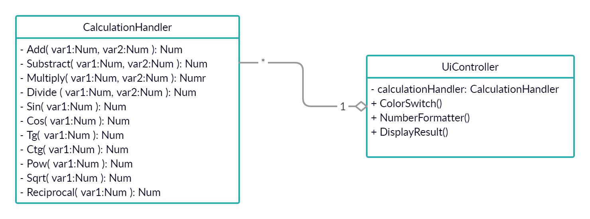

Rendszerterv
============
Mit
---
### Funkcionális terv
#### Rendszer használati esetei, lefutásaik

#### Képernyő tervek
- Az alkalmazás prototípusa az alap színösszeállítással

- Az alkalmazás prototípusa "dark mode"-ban

- Az alkalmazás prototípusa "dark mode"-ban, tablet eszközön

- Az alkalmazás prototípusa "dark mode"-ban, mobil eszközön

#### Elemek a kijelzőn

- A: A böngészőablak, amiben az oldal meg van nyitva.
- B: A kijelző. Ezen megjelenik az aktuális szám, melyet beírtunk vagy eredményként kaptunk, illetve ha végzünk operációt, ami ehhez a számhoz vezetett
- C: A számgombok, melyek lenyomása a kijelzőn szereplő aktív szám végére konkatenálja az adott számjegyet.
- D: Előjelgomb, melynek lenyomása ha a kijelzőn aktív szám pozitív, negatívvá teszi, ha pedig az aktív szám pozitív, akkor negatívvá teszi.
- E: Tizedespont, mely lehetőve teszi a számok tizedestörtként való megadását. A szám egészrészét a gomb lenyomása előtt adjuk meg, a törtrészét pedig a gomb lenyomása után.
- F: Operációgombok, melyek lenyomása a jelenleg kijelzőn szereplő aktív számot első (vagy egyparaméteres operáció esetén egyetlen) paraméterként véve, az operációt elvégzik, vagy ha arra szükség van, az operáció elvégzése előtt extra paramétereket várnak.
- G: Eredménygomb, melynek lenyomása a kijelzőn jelenleg szereplő kifejezés értékét megjeleníti számként.
- H: Clear gomb, melynek lenyomása a kijelző tartalmát törli.
- I: Törlés gomb, melynek lenyomása a legutóbb bevitt karaktert törli.
- J: Egy legördülő színséma menü, melyre kattintva látunk egy listát, melyen változatos színsémák nevei szerepelnek. Ezek egyikét kiválasztva az adott színsémára váltunk, ami megváltoztatja a számológép és a háttér megjelenését. Ezen belül választhatunk specifikus szituációkban hasznos módokat is, például sötét mód éjszakai használatra, vagy színvak mód, melyben bizonyos színlátási zavarokat kompenzáló sémák vannak, hogy könnyen megkülönböztethetőek legyenek az eltérő színű elemek.
### Fizikai követelmények
- Fizikai környezet: A program tetszőleges operációs rendszeren működjön, melyen van JavaScript-kompatibilis böngésző, legfőképpen Windows, MacOS, Linux, Android és iOS.
- A program működjön az irodában található összes számítógépen, és a felhasználók okostelefonjainak túlnyomó többségén, ne legyen magas a számítási, grafikus, vagy memóriaigény.
- A program teszteléséhez alkalmazzunk egy alkalmas keretrendszert, hogy biztosítsuk a hibamentes működést.
- A program forráskódja legyen nyílt, hogy amennyiben egy felhasználó módosítani kíván a program múködésén, vagy az alapértelmezett funkcionalitáson felüli elemeket kíván hozzáadni, ezt könnyedén, szabadon megtehesse.

Miért
-----
A rendszer legfőbb célja, hogy egy egységes felületet biztosítson a cég alkalmazottai számára a számítások elvégzéséhez. A rendszer integrálható kell, hogy legyen a cég eddigi rendszerébe, így szükségtelenné tegye a korábban használt, külső, nem egységes szolgáltatásokat. Ehhez szabványos web eszközök használata szükséges: JavaScript, HTML, CSS.

Cél, hogy az alkalmazás különböző eszközökön is (például mobil, tablet) zökkenőmentesen működjön, reszponzív design alkalmazásával. 

A felületnek intuitívnak, egyértelműnek kell lennie, hogy mindenki el tudjon rajta igazodni, ezzel elkerülve a felesleges félreértéseket, bonyodalmakat. A felhasználói felület, illetve a megjelenés legyen testreszabható, ezzel hatékonyabbá téve az egyes részlegeken dolgozók munkáját. Az éjszakai mód is nagyban megkönnyíti a későn dolgozó emberek dolgát, illetve egy speciális mód a látás problémákkal küzdő alkalmazottak munkáját segíti.

Fontos elvárás, hogy az alkalmazás a matematikai szabályoknak maradéktalanul eleget tegyen, ugyanis ez nagyon fontos a megrendelő számára. A négy alapműveleten túl is szükség van matematikai műveletekre (K06), kiemelt fontosságú ezek közül a hatványozás, mert ez nagyon sok könyveléshez szükséges számolás esetén elengedhetetlen, mint például a kamatos kamat, jelenérték vagy jövőérték kiszámítása. Az elvégzendő operációt jelenítsük meg, illetve a számokat három számjegyenként tördeljük a könnyebb olvashatóság érdekében. A szám-, illetve operációgombok megjelenésükben különüljenek el. Szükséges továbbá egy Clear gomb is, mely törli az eddig beütött inputokat. A maximum számjegylimit a JavaScript segítségével kerül megoldásra, melyben bizonyos számú karakternél nem enged a rendszer többet egyszerre beírni.

Az alkalmazásban használt számok akár bizalmas adatok is lehetnek, ezért ne tároljuk őket semmilyen más, külső szerveren, csak a cég férjen ezekhez hozzá.

A rendszernek nem célja, hogy teljes mértékben helyettesítsen egy tudományos számológépet. Továbbá a korábbi rendszerbe integrálás nem képezi a projekt részét, pusztán a beépítés lehetőségeihez teremti elő az alkalmazás oldaláról szükséges feltételeket.

Hogyan
------
### Implementációs terv

A program 2 fő osztályt tartalmaz:
- A __CalculationHandler__ osztály felel a számítások helyes elvégzéséért. Tartalmazza az egyes műveletek implementációit.
- A __UiController__ osztály kezeli a felhasználói felületen kiváltott eseményeket, mint a színmód váltása, a szám formázása sé az eredmény kiírása.

### Követelmények
- K01 (Intuitív UI):
    - Úgy kell kialakítani, hogy használata egyértelmű legyen
    - Az egyes funkciókat határozottan el kell különíteni egymástól, ezzel növelve az átláthatóságot.
    - A felhasználó számára biztosítani kell, hogy a korábban beírt karaktersorozatot módosíthassa. (ld. Clear gomb)
- K02 (Grafikus megjelenés):
    - Számok ezres tagolása:
        - Egy metódus segítségével a program minden a számológép felületén végrehajtott felhasználói interakció esetén ellenőrzi az aktuálisan beírt számot, és átalakítja, ha nagyobb, mint 1000. Az elvégzett művelet eredményét a program alapértelmezetten ezres tagolással jeleníti meg.
    - Végzett operáció megjelenítése:
        - Az elvégzett műveletek eredményét egy metódus segítségével megjeleníti a program a felületen úgy, hogy az input mező értékét felülírja.
    - Szám és operációgombok megkülönböztetése
        - Az HTML gombokhoz hozzá van rendelve, hogy a számjegyek vagy a funkciógombok osztályába tartoznak. Így a CSS-ben az osztálynevekre történő hivatkozással be lehet állítani egységes színvilágot.
- K03, K04 (Reszponzív design és Mobil kompatibilitás):
    - A reszponzív webdesign eléréséhez a CSS-ben az elemek méretét nem abszolót mértékegységben adjuk meg, hanem relatív mértékegységekben, mint az *em*, *rem*, *vmin* vagy *vmax*.
    - Mivel webes alkalmazásról van szó, a mobilos kompatibilitás alapból megvalósul. A reszponzív felhasználói felület pedig garantálja a program használhatóságát kijelzőmérettől függetlenül. 
- K05 (Clear gomb): 
    - JavaScript segítségvel lesz elérve ez a funkcionalitás. 
    - Külön függvények fogják tartalmazni, hogy a felhasználó teljes törlést szeretne, vagy csak az utolsó beírt karakter törlését. 
    - Az utolsó karakter törlését megoldhatjuk a __splice()__ fügvénnyel.
    - A teljes törlést pedig az input mező értékének a üres stringgé alakításával valósítjuk meg.
- K06 (Matematikai műveletek): 
    - A matematikai műveletek megvalósításához a JavaScript Math objektuma lesz használva. 
    - Annak függvényében, hogy egy vagy két paraméteres műveletről van szó, a program az adott inputra azonnal visszaadja az eredményt vagy pedig vár a második paraméterre. 
- K07 (Számjegylimit): 
    - A számjegylimit úgy lesz megvalósítva, hogy a felhasználó meghatározott számú karaktert írhat be a szöveges mezőbe. 
    - Ha a számítás eredménye túl nagy lesz, akkor hibaüzenet fog megjelenni.  
- K08 (Kellemes színvilág):
    - A program *normál*, *sötét* és *színvak* módokat biztosítja.
    - Mindegyik mód kap egy külön CSS fájlt, mely meghatározza az egyes HTML elemek színét.
    - A módok közötti váltás a JavaScript kódon belül, az aktuális stílusfájl kicserélésével történik. 

### Tesztterv
A tesztelés tekintetében két fő részre bonthatjuk az eseteket:
- a megfelelő megjelenés tesztelése és
- a matematikai számítások pontossága és a kivételes esetek kezelése.

Megjelenés tesztelése:
- megfelelően vált színt az alkalmazás, az adott módra történő váltás esetén
- adott funkció vagy szám gomb lenyomása esetén változik-e a gomb árnyalata, ezzel visszajelzést küldve a felhasználónak

Matematikai számítások és kivételek tesztelése:
- a matematikai műveletek eredménye megfelelő-e
- bizonyos műveletek esetén a lehetséges kivételes esetek megfelelő kezelése (például nullával való osztás)

Mikor
-----
A rendszert legkésőbb 2020. szeptember 28-ig véglegesíteni kell.

Miből
-----
A fejlesztők saját eszközeiket használva dolgoznak a projekten.
