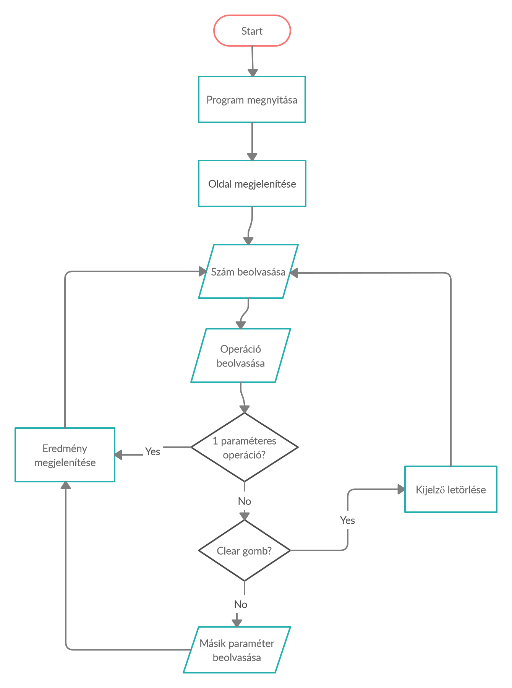
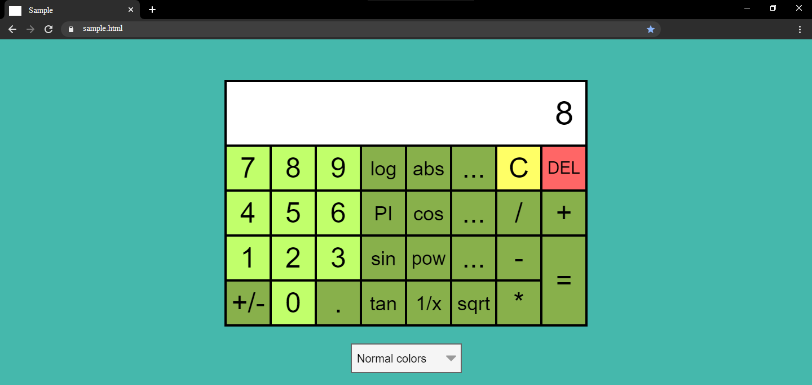
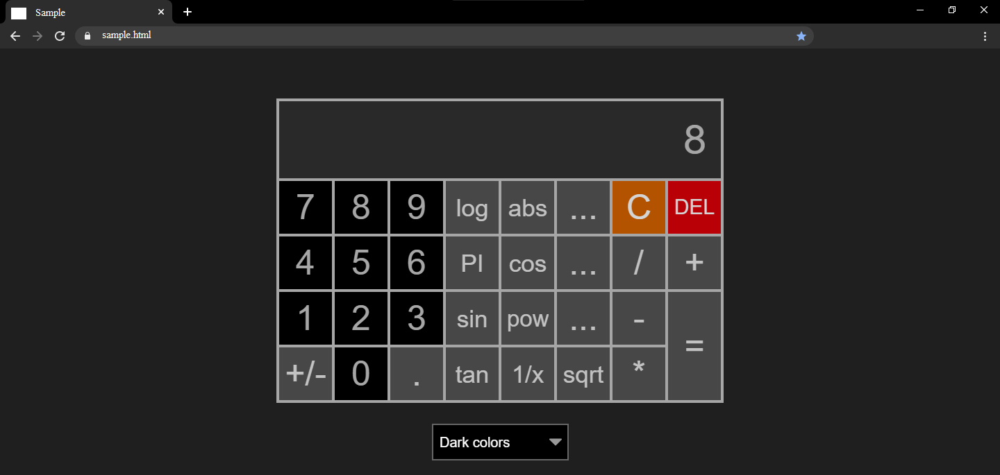
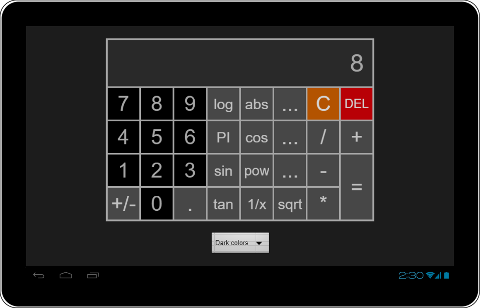
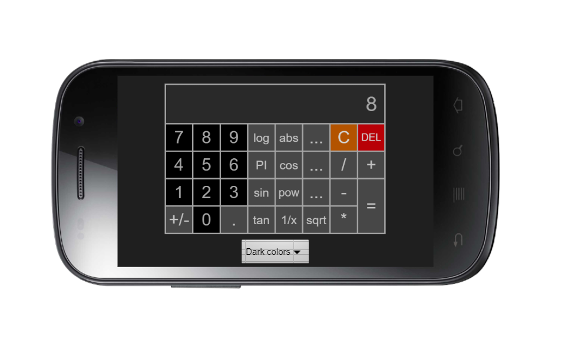
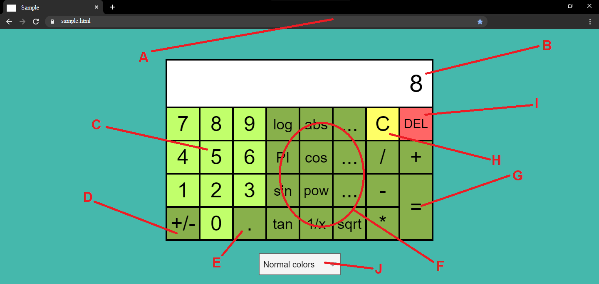

Rendszerterv
============
Mit
---
### Funkcionális terv
#### Rendszer használati esetei, lefutásaik

#### Képernyő tervek
- Az alkalmazás prototípusa az alap színösszeállítással

- Az alkalmazás prototípusa "dark mode"-ban

- Az alkalmazás prototípusa "dark mode"-ban, tablet eszközön

- Az alkalmazás prototípusa "dark mode"-ban, mobil eszközön

#### Elemek a kijelzőn

- A: A böngészőablak, amiben az oldal meg van nyitva.
- B: A kijelző. Ezen megjelenik az aktuális szám, melyet beírtunk vagy eredményként kaptunk, illetve ha végzünk operációt, ami ehhez a számhoz vezetett
- C: A számgombok, melyek lenyomása a kijelzőn szereplő aktív szám végére konkatenálja az adott számjegyet.
- D: Előjelgomb, melynek lenyomása ha a kijelzőn aktív szám pozitív, negatívvá teszi, ha pedig az aktív szám pozitív, akkor negatívvá teszi.
- E: Tizedespont, mely lehetőve teszi a számok tizedestörtként való megadását. A szám egészrészét a gomb lenyomása előtt adjuk meg, a törtrészét pedig a gomb lenyomása után.

Miért
-----

Hogyan
------
### Követelmények
- K01 (Intuitív UI):
    - Úgy kell kialakítani, hogy használata egyértelmű legyen
    - Az egyes funkciókat határozottan el kell különíteni egymástól, ezzel növelve az átláthatóságot.
    - A felhasználó számára biztosítani kell, hogy a korábban beírt karaktersorozatot módosíthassa. (ld. Clear gomb)

Mikor
-----
A rendszert legkésőbb 2020. szeptember 28-ig véglegesíteni kell.

Miből
-----
A fejlesztők saját eszközeiket használva dolgoznak a projekten.
